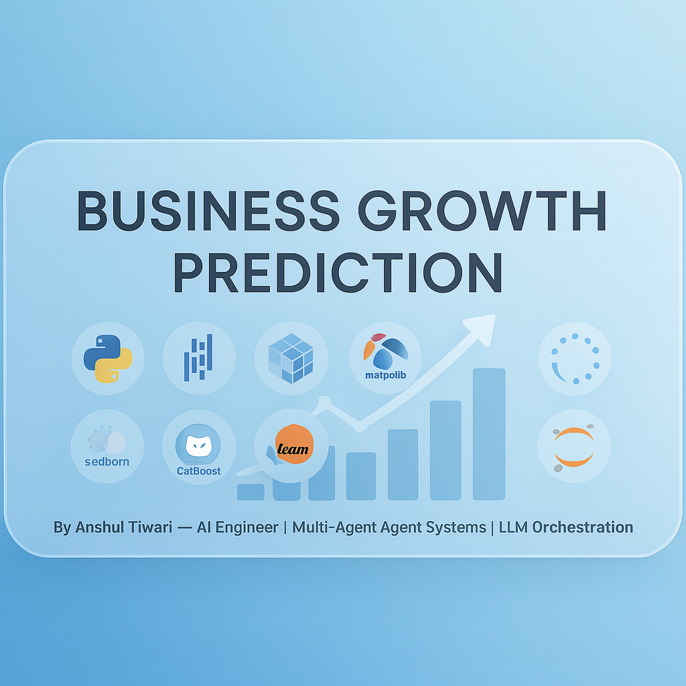

  

<h1 align="center">📈 Business Growth Forecasting — ML-Driven Time Series Demand Prediction</h1>

  A production-grade forecasting system that transforms raw business data into accurate, daily growth predictions using CatBoost, rich lag features, seasonal patterns, and hyperparameter tuning — built for analysts, data scientists, and decision makers.

  
  
  
  
  

---

## 🌟 Overview

**Business Growth Forecasting** turns historical performance data into actionable forward-looking insights.

It provides:

- 📅 Daily time-series forecasting of business metrics  
- 🧱 Lag & rolling-window feature engineering  
- 🧠 CatBoost-based machine learning pipeline  
- 🎯 Hyperparameter tuning over key model dimensions  
- 📊 Robust validation with MAE, RMSE, SMAPE, and R²  
- 🔮 Long-horizon forecast generation with visual outputs  

Built for **business teams, data scientists, and ML practitioners** who need reliable, explainable forecasts for planning and decision-making.

---

## 🧩 Key Features

### 🔹 Feature-Rich Time Series Modeling  
- Aggregates raw transactional data into a clean daily series  
- Builds lag features (1, 2, 3, 7, 14, 28 days)  
- Computes rolling means & volatility windows (7, 14, 30 days)  
- Encodes calendar patterns (weekday, month, week-of-year, weekend flag)  

### 🔹 CatBoost Forecasting Engine  
- Uses **CatBoostRegressor** for robust nonlinear modeling  
- Handles complex patterns and non-stationary behavior  
- Learns from both temporal and calendar-derived features  

### 🔹 Hyperparameter Tuning  
- Structured search over:
  - `depth`
  - `learning_rate`
  - `l2_leaf_reg`  
- Selects best model using **SMAPE** on a time-based validation split  
- Automatically balances bias–variance trade-offs for business data  

### 🔹 Robust Evaluation & Diagnostics  
- Computes:
  - Mean Absolute Error (MAE)  
  - Root Mean Squared Error (RMSE)  
  - Symmetric MAPE (SMAPE)  
  - R² (explained variance)  
- Visualization of:
  - Train vs validation series  
  - Actual vs predicted curves  
  - Forecast vs historical trends  

### 🔹 Future Forecasting & Scenario Analysis  
- Trains a final model on full history  
- Iteratively generates future predictions using rolling features  
- Produces clean forecast plots for:
  - Planning  
  - Budgeting  
  - Growth simulation  

---

## 🧠 System Architecture

```mermaid
flowchart LR
    U[Raw Business Data] --> A[Data Cleaning and Aggregation]
    A --> B[Daily Time Series - Units per Day]
    B --> C[Feature Engineering - Lags, Rolling Stats, Calendar]
    C --> D[Train / Validation Split - Time Based]
    D --> E[CatBoost Models - Different Hyperparameters]
    E --> F[Best Model Selection - SMAPE and RMSE]
    F --> G[Final Model Training - Full History]
    G --> H[Future Forecast Generator - Iterative Predictions]
    H --> I[Visualization and Insights - Growth Curves and Metrics]
```

  

<b>From raw daily data → engineered features → tuned CatBoost model → future business forecasts</b>

## ⚙️ Installation
Clone Repository
git clone https://github.com/Anshultiwari07/Business-Growth-Forecasting.git
cd Business-Growth-Forecasting
Create & Activate Virtual Environment (Recommended)
python -m venv .venv

# Windows
.venv\Scripts\activate

# macOS / Linux
source .venv/bin/activate

## Install Requirements
pip install -r requirements.txt
Run Jupyter Notebook
jupyter notebook
Open the notebook:
notebooks/forecasting_model.ipynb
Inside the notebook you’ll find:

# Data loading & cleaning
# Exploratory Data Analysis (EDA)
# Feature engineering (lags, rolling stats, calendar)
# CatBoost model training & tuning
# Validation metrics & plots
# Future forecast visualization

### 🔑 Environment Variables
No mandatory environment variables are required for basic usage.

Optionally, you can configure environment variables if you want to integrate tracking or logging.

<b>Built by Anshul Tiwari</b>
 